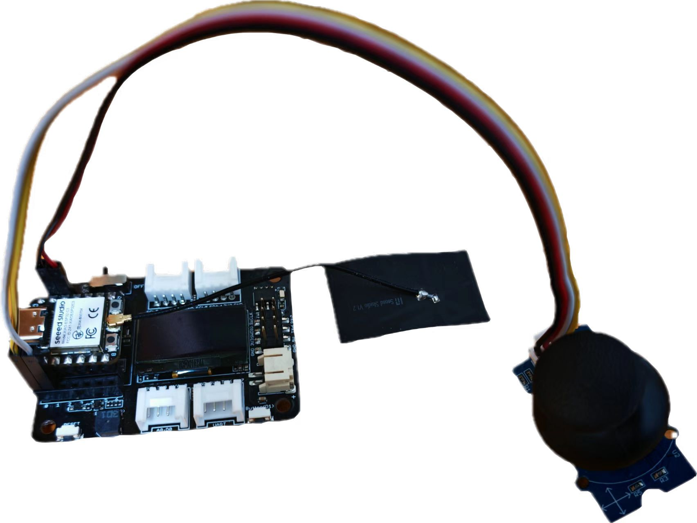
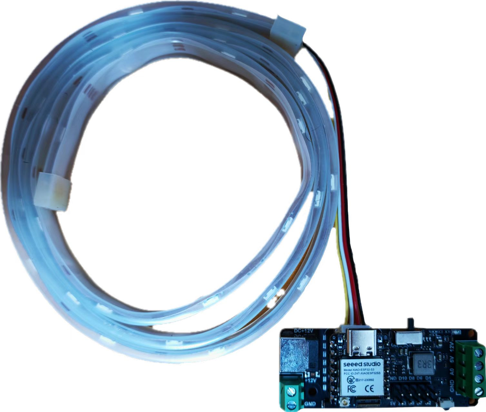
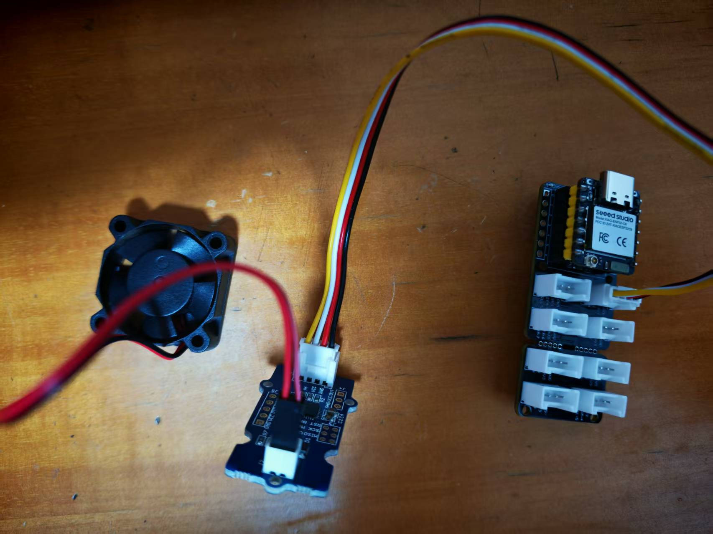
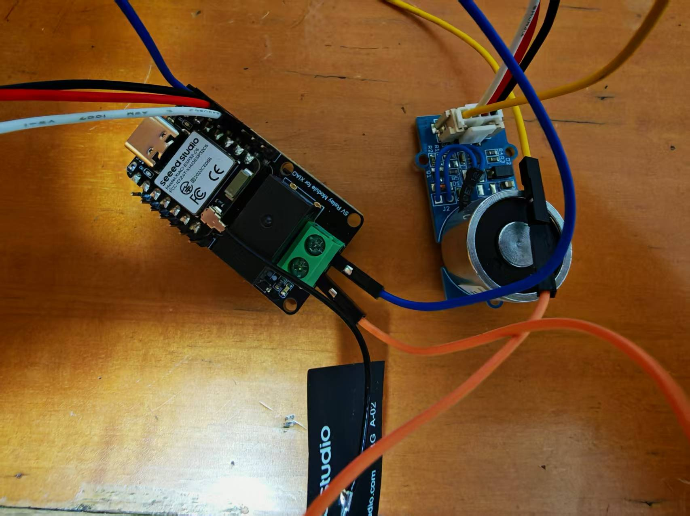
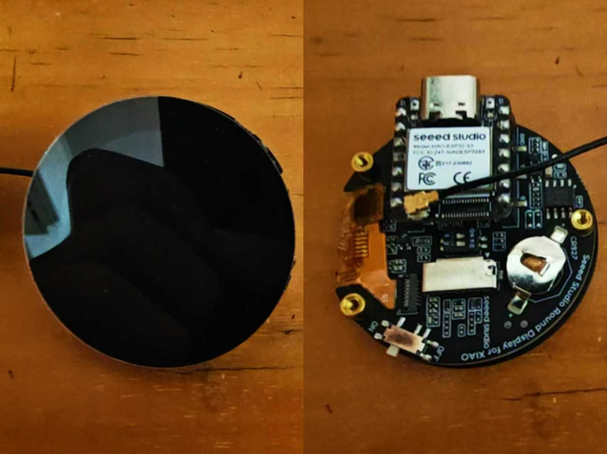

# 🌟 基于xiao的智能家居控制

<p align="center">
  
  
</p>

> 利用 xiao ESP32 系列芯片，打造低成本、易扩展的智能家居控制系统

---

## 🏠 项目背景

随着智能家居的普及，越来越多的用户希望通过**简单、低成本**的方式实现对家中设备的远程和本地智能控制。  
**xiao 系列 ESP32 芯片**体积小巧、功能强大，非常适合用于分布式智能家居系统的开发。  
本项目旨在利用多芯片协作，实现局域网内多设备的互联互控，为智能家居开发者和爱好者提供参考。

---

## ✨ 项目简介

- **主控**：xiao esp32c3（AP模式，WiFi热点）
- **LED灯带**：xiao esp32s3
- **磁吸门锁 & 继电器**：xiao esp32c6
- **风扇**：xiao esp32c6
- **空调控制**：xiao esp32c6
- **通信协议**：UDP
- **人机交互**：OLED 屏+按键菜单

所有节点接入主控 AP 后，通过 UDP 协议进行数据通信。主控 OLED 屏幕实时显示和控制各设备状态。

---

## 📁 项目目录结构

```text
├── code/                # 各功能模块源代码
│   ├── main_controller/     # 主控代码
│   ├── led_strip/           # LED灯带模块代码
│   ├── relay_lock/          # 继电器/门锁模块代码
│   ├── fan/                 # 风扇模块代码
│   ├── air_conditioner/     # 空调控制模块代码
│   └── libs/                # 打包库文件（ZIP）
├── images/             # 硬件连接图、原理图
├── README.md           # 项目说明
```

---

## 📡 UDP通信协议说明

| <b>类型</b>     | <b>命令/反馈</b>         | <b>字段说明</b>                                                                 | <b>示例</b>                          | <b>具体动作/含义</b>                       |
|:--------------:|:------------------------:|:-------------------------------------------------------------------------------:|:-------------------------------------|:------------------------------------------|
| 控制命令        | LED_ON                   | 设备类型_LED_操作（ON/OFF/模式/数值等）                                         | LED_ON<br>LED_OFF<br>FAN_ON<br>AC_TEMP_22 | 打开LED灯<br>关闭LED灯<br>打开风扇<br>空调设为22℃ |
|                | FAN_OFF                  | 设备类型_FAN_操作                                                               | FAN_OFF                             | 关闭风扇                                 |
|                | AC_TEMP_22               | 设备类型_AC_操作/参数                                                           | AC_TEMP_22                          | 设定空调温度为22℃                        |
| 响应格式        | ACK_XXX                  | ACK_命令名，表示命令已被正确执行                                                | ACK_LED_ON                          | 已成功打开LED灯                           |
|                | ACK_FAIL                 | ACK_FAIL，表示命令执行失败，通常附带错误原因（如无响应、参数错误等）             | ACK_FAIL                             | 执行失败，具体原因见节点串口输出           |
|                | STATUS_XXX:ON/OFF        | STATUS_设备名:状态                                                              | STATUS_LED:ON<br>STATUS_FAN:OFF     | 查询设备当前状态，ON为开，OFF为关           |
| 状态反馈        | ACK_XXX                  | 见上                                                                             | ACK_FAN_ON                          | 风扇已打开                               |
|                | STATUS_XXX:ON/OFF        | 见上                                                                             | STATUS_AC:ON                         | 空调当前处于开启状态                      |
|                | ACK_FAIL                 | 见上                                                                             | ACK_FAIL                             | 节点未能正确响应，或命令格式错误           |
| 其他说明        | 端口、广播/单播、超时等   | 端口号、广播/单播机制、超时重发等请参考各模块代码                               | -                                   | 通信细节依模块实现为准                    |

**字段解析与扩展说明：**
- 控制命令：主控通过如 `LED_ON`、`FAN_OFF`、`AC_TEMP_22` 等命令控制各节点设备，不同命令代表不同设备和操作，建议命令格式保持简洁明了。
- 响应/状态反馈：
  - `ACK_XXX` 表示命令已被节点正确执行（如 `ACK_LED_ON`）。
  - `ACK_FAIL` 表示命令执行失败，通常节点会在串口输出具体原因（如设备离线、参数非法等）。
  - `STATUS_XXX:ON/OFF` 表示设备当前状态反馈（如 `STATUS_LED:ON` 表示LED灯已开启）。
- 多设备状态反馈时，可多条状态依次返回或采用JSON格式批量反馈。
- 推荐协议格式逐步扩展为 <b>JSON</b>，如：
  ```json
  {"type":"control", "target":"led", "action":"on"}
  {"type":"status", "target":"fan", "state":"off"}
  ```

> ⚠️ 命令/反馈字段请严格区分大小写，避免歧义。具体命令及参数请参考各模块代码与文档。

---

## 🧩 各模块设计

### 3.1 主控模块（xiao esp32c3）

#### 🛠️ 原理
- 作为 AP，无需外部路由器，所有设备连接到 c3
- 通过 UDP 广播/单播与各节点通信
- OLED 显示菜单，按键切换和控制设备

#### 🔌 硬件连接

| 设备      | 接口         | 说明         |
|---------|------------|------------|
| xiao esp32c3 | WiFi AP | AP模式，无需外部路由器，所有设备连接到 c3 |
| OLED    | I2C        | 显示菜单     |
| 摇杆    | GPIO       | 菜单切换/控制  |
| 电池    | 3.3V       | 供电         |

<div align="center">
  
</div>

*主控模块硬件连接示意图*

#### 📦 硬件介绍

- **xiao esp32c3**
  - 支持 WiFi AP（热点）功能，可作为局域网中心节点
  - 丰富的 GPIO 引脚，支持多种外设扩展
  - 集成 ADC，可采集模拟信号，适合传感器输入
  - [在 Seeed Bazaar 购买 xiao esp32c3](https://www.seeedstudio.com/Seeed-XIAO-ESP32C3-p-5431.html)

- **xiao 拓展部件**
  - OLED 屏幕：用于菜单显示和状态反馈
  - 电池接口：支持锂电池供电，便于移动应用
  - 蜂鸣器：可用于声音提示和报警
  - [在 Seeed Bazaar 购买 xiao 扩展板](https://www.seeedstudio.com/Seeed-XIAO-Expansion-board-p-5201.html)

- **Grove-摇杆**
  - 通过模拟信号（ADC）与主控连接，实现方向和按压操作
  - 用于菜单切换和控制各节点设备
  - [在 Seeed Bazaar 购买 Grove-摇杆](https://www.seeedstudio.com/Grove-Joystick-p-756.html)

**控制示例代码（主控发送UDP协议指令）**
```cpp
// 发送控制协议示例（主控菜单操作时调用）
  switch (menuId) {
    case 1: // LED
      if (opt == 0) payload = "LED_ON";
      else if (opt == 1) payload = "LED_OFF";
      break;
    case 2: // Delay
      payload = (opt == 0) ? "DELAY_ON" : "DELAY_OFF";
      break;
    case 3: // Fan
      payload = (opt == 0) ? "FAN_ON" : "FAN_OFF";
      break;
    case 4: // Air
      payload = (opt == 0) ? "AIR_ON" : "AIR_OFF";
      break;
    default:
      return;
  }

```

#### 💻 快速开始
1. 打开 Arduino IDE，安装以下库：
   - esp32板载包（v3.2.0）  
     [https://github.com/espressif/arduino-esp32](https://github.com/espressif/arduino-esp32)
   - U8g2 ≥ 2.26.0  
     [https://github.com/olikraus/U8g2_Arduino](https://github.com/olikraus/U8g2_Arduino)
2. 上传固件，打开串口（115200 波特）查看启动日志
3. 通过摇杆操作菜单，控制各节点

---

### 3.2 LED 灯带模块（xiao esp32s3）

#### 🛠️ 原理
- xiao esp32s3 作为 WiFi station 连接主控 AP
- 监听 UDP 控制指令，控制 LED 灯带亮灭、颜色等
- 状态变化通过 UDP 回复主控

#### 🔌 硬件连接

| 设备          | 接口         | 说明         |
|--------------|--------------|----------------|
| xiao esp32s3 | WiFi station | 连接主控 AP     |
| LED驱动板     | GPIO         | 驱动LED灯带     |
| LED灯带       | GPIO         | WS2812/APA102等 |
| 电源          | USB/3.3V     | 供电            |

<div align="center">
  
</div>

*LED灯带模块硬件连接示意图*

#### 📦 硬件介绍

- **xiao esp32s3**
  - 支持 WiFi station 功能，轻松接入主控 AP
  - 丰富的 GPIO 支持多种外设扩展
  - [在 Seeed Bazaar 购买 xiao esp32s3](https://www.seeedstudio.com/Seeed-XIAO-ESP32S3-p-5620.html)
- **WS2812B LED灯带**
  - 多彩可编程 LED 灯带，支持多种灯效
  - [在 Seeed Bazaar 购买 WS2812 灯带](https://www.seeedstudio.com/WS2812-LED-Strip-144-LED-m-1m-Black-p-3168.html)
- **电源**
  - USB/3.3V/3.7V锂电池供电，便于部署

**控制示例代码（节点接收并解析UDP指令）**
```cpp
    if (strcmp(incomingPacket, "LED_ON") == 0) {
      ledState = STATIC_COLOR;
      showStatic();
    } else if (strcmp(incomingPacket, "LED_OFF") == 0) {
      ledState = OFF;
      pixels.clear();
      pixels.show();
    } else if (strcmp(incomingPacket, "WATERFALL_LIGHT") == 0) {
      ledState = WATERFALL;
      wfIndex = 0;
      lastMillis = millis();
    }
```

#### 💻 快速开始
1. 打开 Arduino IDE，安装以下库：
   - esp32板载包（v3.2.0）  
     [https://github.com/espressif/arduino-esp32](https://github.com/espressif/arduino-esp32)
   - Adafruit NeoPixel（如使用WS2812）  
     [https://github.com/adafruit/Adafruit_NeoPixel](https://github.com/adafruit/Adafruit_NeoPixel)
2. 上传固件，打开串口（115200 波特）查看启动日志
3. 通过接收主控发送控制指令，控制灯带亮灭与变色

---

### 3.3 风扇模块（xiao esp32c6）

#### 🛠️ 原理
- xiao esp32c6 作为 WiFi station 连接主控 AP
- 监听 UDP 控制指令，控制风扇开关
- 状态变化通过 UDP 回复主控

#### 🔌 硬件连接

| 设备          | 接口         | 说明         |
|--------------|--------------|----------------|
| xiao esp32c6 | WiFi station | 连接主控 AP     |
| 电机驱动板     | GPIO         | 控制电机转动    |
| 风扇          | GPIO         | 转动           |
| 电源          | USB/3.3V     | 供电            |

<div align="center">
  
</div>

*风扇模块硬件连接示意图*

#### 📦 硬件介绍

- **xiao esp32c6**
  - 支持 WiFi station 功能，轻松接入主控 AP
  - 丰富的 GPIO 支持多种外设扩展
  - [在 Seeed Bazaar 购买 xiao esp32c6](https://www.seeedstudio.com/Seeed-XIAO-ESP32C6-p-5635.html)
- **风扇/电机驱动模块**
  - 可通过 GPIO 控制风扇启停及档位
  - 用户可根据需求选择风扇或电机驱动模块
- **电源**
  - USB/3.3V 供电，便于部署

#### 💻 控制示例代码（节点接收并解析UDP指令）
```cpp

    if (strcmp(incomingPacket, "FAN_ON") == 0) {
      digitalWrite(FAN_PIN, HIGH);
    } else if (strcmp(incomingPacket, "FAN_OFF") == 0) {
      digitalWrite(FAN_PIN, LOW);
    }
```

#### 💻 快速开始
1. 打开 Arduino IDE，安装以下库：
   - esp32板载包（v3.2.0）  
     [https://github.com/espressif/arduino-esp32](https://github.com/espressif/arduino-esp32)
2. 上传固件，打开串口（115200 波特）查看启动日志
3. 通过接收主控发送控制指令，控制风扇开关

---

### 3.4 继电器/磁吸门锁模块（xiao esp32c6）

#### 🛠️ 原理
- xiao esp32c6 作为 WiFi station 连接主控 AP
- 监听 UDP 控制指令，控制继电器通断及磁吸门锁开合
- 状态变化通过 UDP 回复主控

#### 🔌 硬件连接

| 设备          | 接口         | 说明         |
|--------------|--------------|----------------|
| xiao esp32c6 | WiFi station | 连接主控 AP     |
| 继电器/磁吸门锁 | GPIO       | 控制门锁/电器通断 |
| 电源          | USB/3.3V     | 供电            |

<div align="center">
  
</div>

*继电器/磁吸门锁模块硬件连接示意图*

#### 📦 硬件介绍

- **xiao esp32c6**
  - 支持 WiFi station 功能，轻松接入主控 AP
  - 丰富的 GPIO 支持多种外设扩展
  - [在 Seeed Bazaar 购买 xiao esp32c6](https://www.seeedstudio.com/Seeed-XIAO-ESP32C6-p-5635.html)
- **Grove 继电器/磁吸门锁**
  - 通过 GPIO 控制门锁或其他用电设备
  - [在 Seeed Bazaar 购买 Grove 继电器](https://www.seeedstudio.com/Grove-Relay-p-769.html)
- **电源**
  - USB/3.3V 供电，便于部署

#### 💻 控制示例代码（节点接收并解析UDP指令）
```cpp
    if (strcmp(incomingPacket, "DELAY_ON") == 0) {
      digitalWrite(RELAY_PIN, HIGH);
    } else if (strcmp(incomingPacket, "DELAY_OFF") == 0) {
      digitalWrite(RELAY_PIN, LOW);
    }
```

#### 💻 快速开始
1. 打开 Arduino IDE，安装以下库：
   - esp32板载包（v3.2.0）  
     [https://github.com/espressif/arduino-esp32](https://github.com/espressif/arduino-esp32)
2. 上传固件，打开串口（115200 波特）查看启动日志
3. 通过主控发送控制指令，测试门锁/继电器通断

---

### 3.5 空调控制模块（xiao esp32s3）    

#### 🛠️ 原理
- xiao esp32s3 作为 WiFi station 连接主控 AP
- 监听 UDP 控制指令，控制空调开关与温度调节
- 状态变化通过 UDP 回复主控

#### 🔌 硬件连接

| 设备          | 接口         | 说明         |
|--------------|--------------|----------------|
| xiao esp32s3 | WiFi station | 连接主控 AP     |
| 圆形显示屏拓展板 | GPIO   | 显示空调界面     |
| 电源          | USB/3.3V     | 供电            |

<div align="center">
  
</div>

*空调控制模块硬件连接示意图*

#### 📦 硬件介绍

- **xiao esp32s3**
  - 支持 WiFi station 功能，轻松接入主控 AP
  - 丰富的 GPIO 支持多种外设扩展
  - [在 Seeed Bazaar 购买 xiao esp32s3](https://www.seeedstudio.com/Seeed-XIAO-ESP32S3-p-5620.html)
- **圆形显示屏拓展板**
  - 通过 GPIO 控制空调开关与温度调节
  - [在 Seeed Bazaar 购买圆形显示屏拓展板](https://www.seeedstudio.com/Seeed-XIAO-Expansion-board-p-5201.html)
- **电源**
  - USB/3.3V 供电，便于部署

#### 💻 控制示例代码（节点接收并解析UDP指令）
```cpp
    if (strcmp(incomingPacket, "AIR_ON") == 0) {
      acOn = true;
      // 更新界面等
    } else if (strcmp(incomingPacket, "AIR_OFF") == 0) {
      acOn = false;
      // 更新界面等
    } else if (strcmp(incomingPacket, "AIR_UP") == 0 && acOn && temperature < 30) {
      temperature++;
      // 更新界面等
    } else if (strcmp(incomingPacket, "AIR_DOWN") == 0 && acOn && temperature > 16) {
      temperature--;
      // 更新界面等
    }
```

#### 💻 快速开始
1. 打开 Arduino IDE，安装以下库：
   - esp32板载包（v3.2.0）  
     [https://github.com/espressif/arduino-esp32](https://github.com/espressif/arduino-esp32)
2. 上传固件，打开串口（115200 波特）查看启动日志
3. 通过接收主控发送控制指令，控制空调开关与温度调节

---

## 🖼️ 整体硬件原理图

> 如下为项目整体硬件连接与网络结构示意图（请补充实际原理图）：

<div align="center">
  
</div>

*如无实际图片，可用 Fritzing/Visio/PowerPoint 绘制并替换此图片*

---

## 🧪 总系统测试

- 启动主控，所有节点设备依次接入 AP
- 主控通过 OLED 菜单选择控制对象，发送控制指令
- 各节点设备根据指令正确执行动作并反馈状态
- 主控实时显示所有设备状态，确保通信稳定、响应及时
- 多次切换、控制，系统无异常断连或卡死

---

## 🚀 待改进部分（Roadmap）

- **设备类型扩展**：计划支持更多传感器、摄像头等模块，欢迎贡献相关驱动和应用示例。
- **协议安全性**：后续将引入 UDP 消息加密（如 AES），支持基本认证和数据完整性校验。
- **远程访问**：增加手机APP、网页端远程控制接口。
- **主控菜单优化**：支持多级菜单、图形化界面和更多交互方式。
- **代码与文档规范**：所有代码将持续优化注释和文档说明，方便二次开发。

---

## 📝 代码与文档规范

- 所有关键函数、协议处理、硬件操作部分均有详细注释
- 每个模块目录下建议配备 `README.md`，说明功能、依赖和用法
- 推荐提交 Pull Request 前先自查注释和文档完整性

---

## 🛠️ 开发环境与兼容性

- 推荐开发环境：**Arduino IDE**（≥1.8.19）
- 所有依赖库已在 `code/libs` 提供 ZIP 包，直接拖入 IDE 即可安装
- 各模块代码建议使用指定版本库，避免兼容性问题
- 如需适配其他开发板/环境，请参考各模块 README 说明

---

## 🤝 社区贡献指南

欢迎任何开发者参与本项目！

- 如发现问题或有新需求，请在 GitHub 提 Issue
- 欢迎提交 Pull Request，建议先 fork 并在分支开发
- 贡献代码请确保注释、文档齐全，便于他人理解和维护
- 讨论区欢迎分享你的应用案例和改进建议

---


