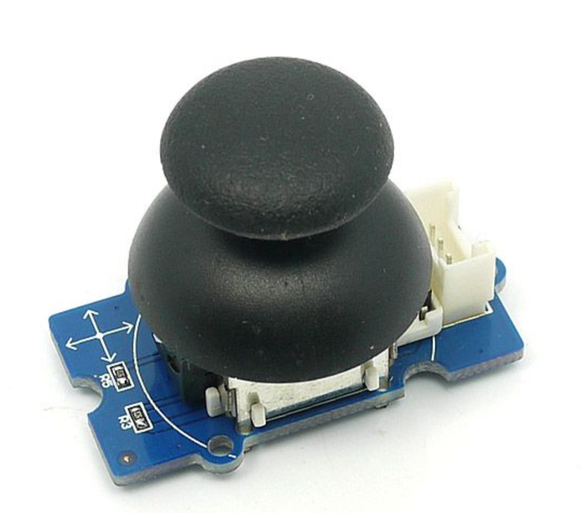
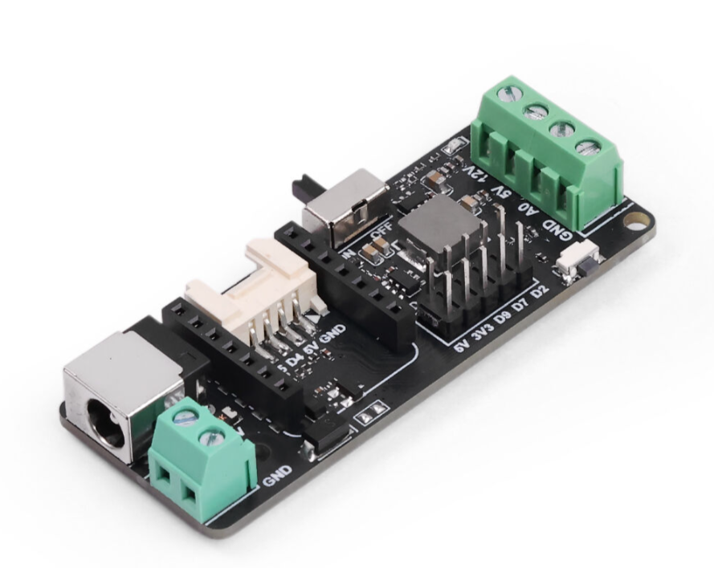
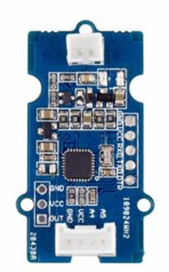
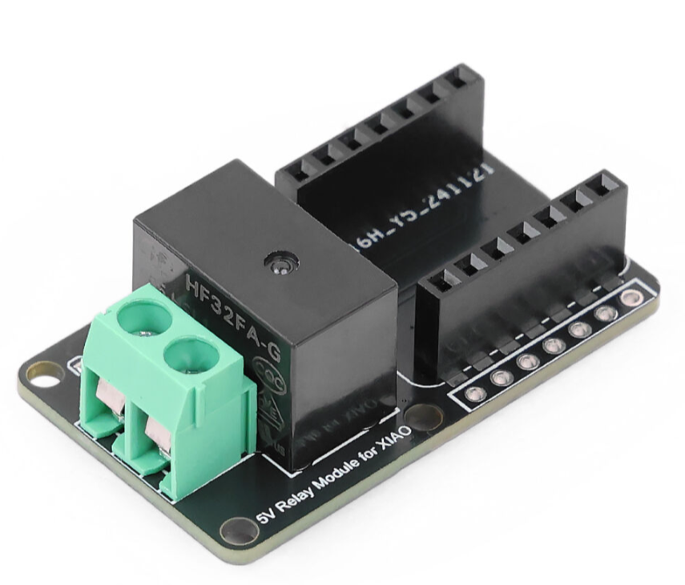
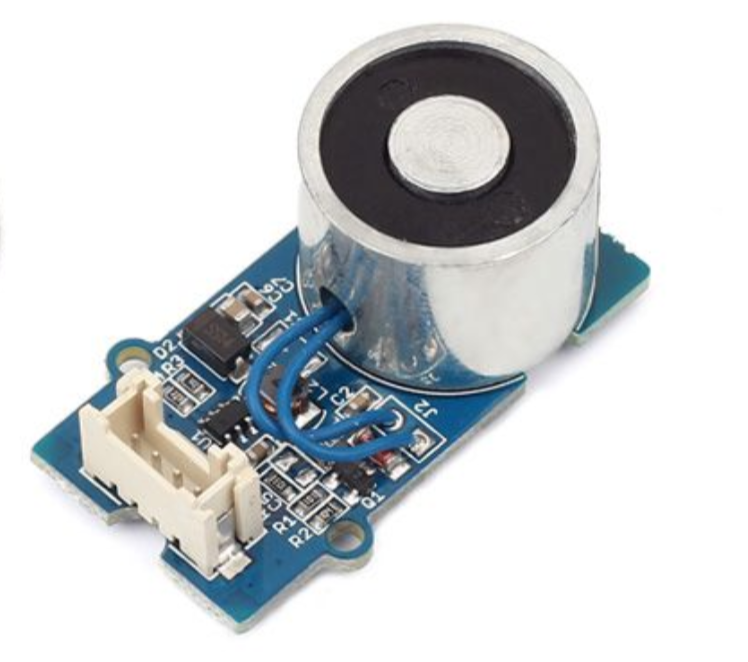

# 🌟 基于xiao的智能家居控制

<p align="center">
  
  
</p>

> 利用 xiao ESP32 系列芯片，打造低成本、易扩展的智能家居控制系统

---

## 🏠 项目背景

随着智能家居的普及，越来越多的用户希望通过**简单、低成本**的方式实现对家中设备的远程和本地智能控制。  
**xiao 系列 ESP32 芯片**体积小巧、功能强大，非常适合用于分布式智能家居系统的开发。  
本项目旨在利用多芯片协作，实现局域网内多设备的互联互控，为智能家居开发者和爱好者提供参考。

---

## ✨ 项目简介

- **主控**：xiao esp32c3（AP模式，WiFi热点）
- **LED灯带**：xiao esp32s3
- **磁吸门锁 & 继电器**：xiao esp32c6
- **风扇**：xiao esp32c6
- **空调控制**：xiao esp32c6
- **通信协议**：UDP
- **人机交互**：OLED 屏+按键菜单

所有节点接入主控 AP 后，通过 UDP 协议进行数据通信。主控 OLED 屏幕实时显示和控制各设备状态。

---

## 📁 项目目录结构

```text
├── code/                # 各功能模块源代码
│   ├── main_controller/     # 主控代码
│   ├── led_strip/           # LED灯带模块代码
│   ├── relay_lock/          # 继电器/门锁模块代码
│   ├── fan/                 # 风扇模块代码
│   ├── air_conditioner/     # 空调控制模块代码
│   └── libs/                # 打包库文件（ZIP）
├── images/             # 硬件连接图、原理图
├── README.md           # 项目说明
```

---

## UDP通信协议说明

本系统各节点与主控通过 UDP 协议进行通信，所有命令及反馈均为**字符串格式**，字段需严格区分大小写。

### 控制命令

| 类型   | 命令         | 说明                | 示例           | 动作/含义         |
|:------:|:------------:|:-------------------:|:--------------:|:-----------------:|
| 控制   | LED_ON       | 打开LED灯           | LED_ON         | 打开LED灯         |
| 控制   | LED_OFF      | 关闭LED灯           | LED_OFF        | 关闭LED灯         |
| 控制   | FAN_ON       | 打开风扇            | FAN_ON         | 打开风扇          |
| 控制   | FAN_OFF      | 关闭风扇            | FAN_OFF        | 关闭风扇          |
| 控制   | AC_TEMP_22   | 设定空调温度为22℃   | AC_TEMP_22     | 空调温度设为22℃   |

### 响应/状态反馈

| 类型   | 命令/反馈           | 说明                         | 示例           | 含义说明               |
|:------:|:-------------------:|:----------------------------:|:--------------:|:----------------------:|
| 响应   | ACK_LED_ON          | 已成功打开LED灯              | ACK_LED_ON     | 控制命令执行成功        |
| 响应   | ACK_FAIL            | 命令执行失败，附带错误原因   | ACK_FAIL       | 失败，具体原因见串口    |
| 状态   | STATUS_LED:ON/OFF   | 查询LED灯当前状态            | STATUS_LED:ON  | LED灯当前为开/关        |
| 状态   | STATUS_FAN:ON/OFF   | 查询风扇当前状态             | STATUS_FAN:OFF | 风扇当前为关            |

### 示例数据包

```text
LED_ON
ACK_LED_ON
STATUS_LED:ON
```

### 注意事项

- 所有命令、反馈均为纯英文字符串，**大小写敏感**。
- 具体命令及参数请参考各功能模块说明与代码。
- 网络通信建议使用 UTF-8 编码。
- 推荐协议格式逐步扩展为 JSON，例如：
  ```json
  {"type":"control", "target":"led", "action":"on"}
  {"type":"status", "target":"fan", "state":"off"}
  ```

> ⚠️ 命令/反馈字段请严格区分大小写，避免歧义。具体命令及参数请参考各模块代码与文档。

---

## 🧩 各模块设计

### 3.1 主控模块（xiao esp32c3）

#### 🛠️ 原理
- 作为 AP，无需外部路由器，所有设备连接到 c3
- 通过 UDP 广播/单播与各节点通信
- OLED 显示菜单，按键切换和控制设备

#### 🔌 硬件连接

| 设备      | 接口         | 说明         | GPIO分配 |
|---------|------------|------------|----------|
| xiao esp32c3 | WiFi AP | AP模式，无需外部路由器，所有设备连接到 c3 | -        |
| OLED    | I2C        | 显示菜单     | -        |
| 摇杆    | GPIO       | 菜单切换/控制  | A0（X轴/上下/进入），A1（Y轴/退回） |
| 电池    | 3.3V       | 供电         | -        |

<div align="center">
  
</div>

<div align="center">
主控模块硬件连接示意图
</div>

#### 📦 硬件介绍

- **xiao esp32c3**
  - 支持 WiFi AP（热点）功能，可作为局域网中心节点
  - 丰富的 GPIO 引脚，支持多种外设扩展
  - 集成 ADC，可采集模拟信号，适合传感器输入
  - [在 Seeed Bazaar 购买 xiao esp32c3](https://www.seeedstudio.com/Seeed-Studio-XIAO-ESP32C3-Tape-Reel-p-6471.html)
<div align="center">
  
</div>

<div align="center">
xiao esp32c3引脚图
</div>

- **xiao 拓展部件**
  - OLED 屏幕：用于菜单显示和状态反馈
    - 工作原理：主控（xiao esp32c3）通过 I2C 接口向 OLED 发送命令和数据，控制像素点的显示状态，进而显示菜单、图标或文字。

  - 电池接口：支持锂电池供电，便于移动应用
  
  - 蜂鸣器：用于声音提示和报警
    - 工作原理：通过控制引脚输出高电平，使蜂鸣器发出声音。
  - [在 Seeed Bazaar 购买 xiao 扩展板](https://www.seeedstudio.com/Seeeduino-XIAO-Expansion-board-p-4746.html)
<div align="center">
  
</div>

<div align="center">
xiao_扩展板图
</div>

- **Grove-摇杆**
  - 采用三路电位器结构，X轴、Y轴、按键（SW）均输出模拟电压信号，通过ADC引脚（如A0、A1）读取
  - 常用于菜单切换、方向控制等人机交互场景

| 功能       | 输出类型   | 典型引脚      | 电压区间与判定说明                                   |
|------------|------------|---------------|------------------------------------------------------|
| X 轴       | 模拟电压   | A0（ADC）     | 0~1.2V为左，1.2~3.4V为右                             |
| Y 轴       | 模拟电压   | A1（ADC）     | 0~1.2V为上，1.2~3.4V为下                             |
| 按键（SW） | 模拟电压   | A0/A1（ADC）  | 3.8V以上为按键按下                                   |

  - [在 Seeed Bazaar 购买 Grove-摇杆](https://www.seeedstudio.com/Grove-Thumb-Joystick.html)

<div align="center">
  
  <br>
  <span style="font-size:14px;color:#666;">摇杆图</span>
</div>

**控制示例代码（主控发送UDP协议指令）**
```cpp
// 发送控制协议示例（主控菜单操作时调用）
switch (menuId) {
  case 1: // LED 灯带控制
    if (opt == 0) payload = "LED_ON";   // 选择“开灯”
    else if (opt == 1) payload = "LED_OFF"; // 选择“关灯”
    break;
  case 2: // 延时/定时控制
    payload = (opt == 0) ? "DELAY_ON" : "DELAY_OFF"; // 开启/关闭定时
    break;
  case 3: // 风扇控制
    payload = (opt == 0) ? "FAN_ON" : "FAN_OFF"; // 开/关风扇
    break;
  case 4: // 空调控制
    payload = (opt == 0) ? "AIR_ON" : "AIR_OFF"; // 开/关空调
    break;
  default:
    return; // 其他菜单项不处理
}
```


#### 💻 快速开始
1. 打开 Arduino IDE，安装以下库：
   - esp32板载包（v3.2.0）  
     [https://github.com/espressif/arduino-esp32](https://github.com/espressif/arduino-esp32)
   - U8g2 ≥ 2.26.0  
     [https://github.com/olikraus/U8g2_Arduino](https://github.com/olikraus/U8g2_Arduino)
2. 上传固件，打开串口（115200 波特）查看启动日志
3. 通过摇杆操作菜单，控制各节点

<div align="center">
  
</div>

<div align="center">
主控demo演示
</div>
---

### 3.2 LED 灯带模块（xiao esp32s3）

#### 🛠️ 原理
- xiao esp32s3 作为 WiFi station 连接主控 AP
- 监听 UDP 控制指令，控制 LED 灯带亮灭、颜色等
- 状态变化通过 UDP 回复主控

#### 🔌 硬件连接

| 设备          | 接口         | 说明         | GPIO分配 |
|--------------|--------------|----------------|----------|
| xiao esp32s3 | WiFi station | 连接主控 AP     | -        |
| LED驱动板     | GPIO         | 驱动LED灯带     | -        |
| LED灯带       | GPIO         | WS2812/APA102等 | A4       |
| 电源          | USB/3.3V     | 供电            | -        |

<div align="center">
  
</div>

<div align="center">
LED灯带模块硬件连接示意图
</div>

#### 📦 硬件介绍

- **xiao esp32s3**
  - 支持 WiFi station 功能，轻松接入主控 AP
  - 丰富的 GPIO 支持多种外设扩展
  - [在 Seeed Bazaar 购买 xiao esp32s3](https://www.seeedstudio.com/Seeed-Studio-XIAO-ESP32S3-Pre-Soldered-p-6334.html)
<div align="center">
  
</div>

<div align="center">
主控模块引脚图
</div>

- **WS2812B LED灯带**
  - WS2812B 是集成驱动的智能全彩 LED，每颗灯珠包含 RGB 三色 LED 和驱动电路，多个 WS2812B 可串联组成灯带，支持逐颗编程控制，实现炫彩动态效果。
  - 接口说明：  
    - VCC（红线）：5V 供电  
    - GND（黑线）：地  
    - DIN（绿线）：单线串行控制信号输入
  - 工作原理：  
    - 采用单线串行协议，主控（xiao esp32s3）以 800kHz PWM 数据流写入全部 RGB 数据，第一个 WS2812B 依次转发后续数据，实现级联控制。  
    - 每颗像素 3 字节（R/G/B），可实现高速动画和丰富灯效。
  - [在 Seeed Bazaar 购买 WS2812 灯带](https://www.seeedstudio.com/WS2813B-Digital-RGB-LED-Flexi-Strip-60-LED-1-Meter-p-2817.html)

- **xiao-LED驱动板**
  - 该扩展板用于直接驱动 WS2812 灯带，集成电源稳压与信号缓冲，确保兼容性和可靠性。
  - 功能说明：  
    - 内置电平转换器，将 xiao esp32s3 的 3.3V 数字信号提升至 5V，保证 WS2812 灯带可靠响应  
    - 提供大电流供电电路，满足多颗 LED 同时点亮的电流需求
  - 控制方式：  
    - 灯带数据线连接 xiao esp32s3 的 GPIO（A4），通过库函数控制每颗 LED 的颜色和亮度（strip.setPixelColor(i, color)）
  - [在 Seeed Bazaar 购买 xiao-LED驱动板](https://www.seeedstudio.com/LED-Driver-Board-for-Seeed-Studio-XIAO-p-6451.html)

<div align="center">
  
  <br>
  <span style="font-size:14px;color:#666;">xiao-LED驱动板实物图</span>
</div>

- **电源**
  - USB/3.3V/3.7V锂电池供电，便于部署

**控制示例代码（节点接收并解析UDP指令）**
```cpp
// 节点端接收主控UDP指令，控制LED灯带
if (strcmp(incomingPacket, "LED_ON") == 0) {
  ledState = STATIC_COLOR;    // 设置为静态常亮模式
  showStatic();               // 显示静态灯效
} else if (strcmp(incomingPacket, "LED_OFF") == 0) {
  ledState = OFF;             // 设置为关闭状态
  pixels.clear();             // 熄灭所有LED
  pixels.show();
} else if (strcmp(incomingPacket, "WATERFALL_LIGHT") == 0) {
  ledState = WATERFALL;       // 设置为流水灯模式
  wfIndex = 0;                // 重置流水灯索引
  lastMillis = millis();      // 记录当前时间用于动画
}
```

#### 💻 快速开始
1. 打开 Arduino IDE，安装以下库：
   - esp32板载包（v3.2.0）  
     [https://github.com/espressif/arduino-esp32](https://github.com/espressif/arduino-esp32)
   - Adafruit NeoPixel（如使用WS2812）  
     [https://github.com/adafruit/Adafruit_NeoPixel](https://github.com/adafruit/Adafruit_NeoPixel)
2. 上传固件，打开串口（115200 波特）查看启动日志
3. 通过接收主控发送控制指令，控制灯带亮灭与变色

<div align="center">
  
</div>

<div align="center">
LED灯带demo演示
</div>

---

### 3.3 风扇模块（xiao esp32c6）

#### 🛠️ 原理
- xiao esp32c6 作为 WiFi station 连接主控 AP
- 监听 UDP 控制指令，控制风扇开关
- 状态变化通过 UDP 回复主控

#### 🔌 硬件连接

| 设备          | 接口         | 说明         | GPIO分配 |
|--------------|--------------|----------------|----------|
| xiao esp32c6 | WiFi station | 连接主控 AP     | -        |
| 电机驱动板     | GPIO         | 控制电机转动    | -        |
| 风扇          | GPIO         | 转动           | A0       |
| 电源          | USB/3.3V     | 供电            | -        |

<div align="center">
  
</div>

<div align="center">
风扇模块硬件连接示意图
</div>

#### 📦 硬件介绍

- **xiao esp32c6**
  - 支持 WiFi station 功能，轻松接入主控 AP
  - 丰富的 GPIO 支持多种外设扩展
  - [在 Seeed Bazaar 购买 xiao esp32c6](https://www.seeedstudio.com/Seeed-Studio-XIAO-ESP32C6-Pre-Soldered-p-6328.html)
<div align="center">
  
</div>

<div align="center">
xiao_esp32c6引脚图
</div>

- **电机驱动模块**
  - Grove Mini Fan v1.1，核心为 N 沟 MOSFET + 小型直流风扇
  - Grove 标准 4-pin 接口（实际只用 VCC + 控制引脚），典型 5V 供电（3.3V可用但转速降低）
  - 工作原理：  
    - 主控通过 GPIO 控制 MOSFET 栅极，实现对风扇的电子开关控制
    - HIGH（1）：MOSFET 导通，风扇转动  
    - LOW（0）：MOSFET 截止，风扇停止
    - 类似继电器，但速度更快、体积更小
  - [在 Seeed Bazaar 购买 Grove-电机驱动模块](https://www.seeedstudio.com/Grove-Mini-Fan-v1-1.html)
<div align="center">
  
  <br>
  <span style="font-size:14px;color:#666;">电机驱动模块图</span>
</div>

- **风扇**
  - 支持两种控制方式：  
    1. 启停控制（数字控制）：GPIO 输出 HIGH/LOW 控制风扇开/关  
    2. 档位控制（PWM 控速）：如风扇支持，可用 analogWrite()/ledcWrite() 实现不同转速档位
  - 可通过 GPIO 控制风扇启停及档位

- **电源**
  - USB/3.3V 供电，便于部署

#### 💻 控制示例代码（节点接收并解析UDP指令）
```cpp
// 节点端接收主控UDP指令，控制风扇开关
// incomingPacket 为接收到的 UDP 数据包
if (strcmp(incomingPacket, "FAN_ON") == 0) {
  // 比较接收到的指令，如果是“FAN_ON”，则打开风扇
  digitalWrite(FAN_PIN, HIGH);   // 打开发扇
} else if (strcmp(incomingPacket, "FAN_OFF") == 0) {
  // 如果是“FAN_OFF”，则关闭风扇
  digitalWrite(FAN_PIN, LOW);    // 关闭风扇
}
```

#### 💻 快速开始
1. 打开 Arduino IDE，安装以下库：
   - esp32板载包（v3.2.0）  
     [https://github.com/espressif/arduino-esp32](https://github.com/espressif/arduino-esp32)
2. 上传固件，打开串口（115200 波特）查看启动日志
3. 通过接收主控发送控制指令，控制风扇开关

<div align="center">
  
</div>

<div align="center">
风扇demo演示
</div>

---

### 3.4 继电器/磁吸门锁模块（xiao esp32c6）

#### 🛠️ 原理
- xiao esp32c6 作为 WiFi station 连接主控 AP
- 监听 UDP 控制指令，控制继电器通断及磁吸门锁开合
- 状态变化通过 UDP 回复主控

#### 🔌 硬件连接

| 设备          | 接口         | 说明         | GPIO分配 |
|--------------|--------------|----------------|----------|
| xiao esp32c6 | WiFi station | 连接主控 AP     | -        |
| 继电器/磁吸门锁 | GPIO       | 控制门锁/电器通断 | D1       |
| 电源          | USB/3.3V     | 供电            | -        |

<div align="center">
  
</div>

<div align="center">
继电器/磁吸门锁模块硬件连接示意图
</div>

<div align="center">
继电器/磁吸门锁模块demo演示
</div>

#### 📦 硬件介绍

- **xiao esp32c6**
  - 支持 WiFi station 功能，轻松接入主控 AP
  - 丰富的 GPIO 支持多种外设扩展
  - [在 Seeed Bazaar 购买 xiao esp32c6](https://www.seeedstudio.com/Seeed-Studio-XIAO-ESP32C6-Pre-Soldered-p-6328.html)

- **Grove 继电器**
  - 主控侧通过 Grove 接口 SIG 脚接收 3.3V/5V 控制信号，内部集成 NPN 晶体管或 MOSFET 与反向保护二极管，驱动继电器线圈。
  - 负载侧提供 NO（常开）、NC（常闭）、COM（公共端）三端子，可安全切换高压/大电流设备，实现主控与负载物理隔离。
  - [在 Seeed Bazaar 购买 Grove 继电器](https://www.seeedstudio.com/Relay-add-on-module-for-XIAO-p-6310.html)

  **工作机制：**

  | 控制引脚状态 | 继电器状态   | 负载连接                |
  |--------------|--------------|-------------------------|
  | LOW（默认）  | 继电器释放   | NO 断开（设备关闭）      |
  | HIGH（3.3/5V）| 继电器吸合  | NO → COM 接通（设备开启）|

  主控 GPIO 输出 HIGH，SIG 脚导通，继电器吸合，安全控制高压电路。

<div align="center">
  
  <br>
  <span style="font-size:14px;color:#666;">继电器模块图</span>
</div>

- **Grove 磁吸门锁**
  - 内部为电磁铁，通电后产生磁力吸附门闩或铁片，实现上锁。多数为“通电上锁，断电解锁”（Fail-safe），适合门禁与紧急安全系统。
  - 通过 Grove 继电器切换门锁电源通断，实现门的开/关。门锁需 12V 或更高电压，必须通过继电器切换，主控不能直接供电。
  - [在 Seeed Bazaar 购买 Grove 磁吸门锁](https://www.seeedstudio.com/Grove-Electromagnet.html)

  **控制逻辑：**

  | 电源状态 | 门锁状态     |
  |----------|--------------|
  | 通电     | 吸附锁定     |
  | 断电     | 失电解锁     |

<div align="center">
  
  <br>
  <span style="font-size:14px;color:#666;">磁吸门锁模块图</span>
</div>

- **电源**
  - USB/3.3V 供电，便于部署

#### 💻 控制示例代码（节点接收并解析UDP指令）
```cpp
    if (strcmp(incomingPacket, "DELAY_ON") == 0) {
      digitalWrite(RELAY_PIN, HIGH);
    } else if (strcmp(incomingPacket, "DELAY_OFF") == 0) {
      digitalWrite(RELAY_PIN, LOW);
    }
```

#### 💻 快速开始
1. 打开 Arduino IDE，安装以下库：
   - esp32板载包（v3.2.0）  
     [https://github.com/espressif/arduino-esp32](https://github.com/espressif/arduino-esp32)
2. 上传固件，打开串口（115200 波特）查看启动日志
3. 通过主控发送控制指令，测试门锁/继电器通断

<div align="center">
  
</div>

---

### 3.5 空调控制模块（xiao esp32s3）    

#### 🛠️ 原理
- xiao esp32s3 作为 WiFi station 连接主控 AP
- 监听 UDP 控制指令，控制空调开关与温度调节
- 状态变化通过 UDP 回复主控

#### 🔌 硬件连接

| 设备          | 接口         | 说明         |
|--------------|--------------|----------------|
| xiao esp32s3 | WiFi station | 连接主控 AP     |
| 圆形显示屏拓展板 | GPIO   | 显示空调界面     |
| 电源          | USB/3.3V     | 供电            |

<div align="center">
  
</div>

<div align="center">
空调控制模块硬件连接示意图
</div>

<div align="center">
空调控制demo演示
</div>

#### 📦 硬件介绍

- **xiao esp32s3**
  - 支持 WiFi station 功能，轻松接入主控 AP
  - 丰富的 GPIO 支持多种外设扩展
  - [在 Seeed Bazaar 购买 xiao esp32s3](https://www.seeedstudio.com/Seeed-Studio-XIAO-ESP32S3-Pre-Soldered-p-6334.html)

- **圆形显示屏拓展板**
  - 由 Seeed 专为 XIAO 系列（ESP32S3/C3/NRF）设计，集成多种功能组件，便于空调等智能家居场景开发。
  - [在 Seeed Bazaar 购买圆形显示屏拓展板](https://www.seeedstudio.com/Seeed-Studio-Round-Display-for-XIAO-p-5638.html)

  **主要硬件组成：**

  | 组件                   | 功能说明                                   | 用于空调控制中作用                        |
  |------------------------|--------------------------------------------|-------------------------------------------|
  | 1.28 英寸圆形触控屏    | 240×240 全彩显示，支持电容触控（FT6236）   | 显示空调开关状态、当前温度、操作界面等    |
  | FT6236 电容触控芯片    | 多点触控，I2C 接口                         | 实现用户点击“开/关”、“温度调节”功能      |
  | 电源电路               | 支持 USB/锂电/3.3V 输入，充电管理           | 稳定供电给 XIAO 与屏幕                    |
  | 扩展接口               | 多组 Grove、GPIO、I2C/SPI 排针              | 可连接继电器、温度传感器、蜂鸣器等         |
  | 其他                   | 电池接口、稳压芯片等                       | 支持便携部署、移动供电                    |

  **显示与触控原理：**
  - 屏幕采用 GC9A01 驱动，通过 SPI 与 XIAO 通信。
  - 支持 lvgl、TFT_eSPI、Adafruit_GFX 等图形库进行界面绘制。
  - 显示内容可包括当前温度（如 26°C）、空调状态（ON/OFF）、升/降温按钮图标（+ / -）等。

- **电源**
  - USB/3.3V 供电，便于部署

#### 💻 控制示例代码（节点接收并解析UDP指令）
```cpp
// 节点端接收主控UDP指令，控制空调开关和温度
if (strcmp(incomingPacket, "AIR_ON") == 0) {
  acOn = true;            // 打开空调
  // 可在此处更新界面显示等
} else if (strcmp(incomingPacket, "AIR_OFF") == 0) {
  acOn = false;           // 关闭空调
  // 可在此处更新界面显示等
} else if (strcmp(incomingPacket, "AIR_UP") == 0 && acOn && temperature < 30) {
  temperature++;          // 温度加1度（上限30）
  // 可在此处更新界面显示等
} else if (strcmp(incomingPacket, "AIR_DOWN") == 0 && acOn && temperature > 16) {
  temperature--;          // 温度减1度（下限16）
  // 可在此处更新界面显示等
}
```

#### 💻 快速开始
1. 打开 Arduino IDE，安装以下库：
   - esp32板载包（v3.2.0）  
     [https://github.com/espressif/arduino-esp32](https://github.com/espressif/arduino-esp32)
2. 上传固件，打开串口（115200 波特）查看启动日志
3. 通过接收主控发送控制指令，控制空调开关与温度调节

<div align="center">
  
</div>

---

## 🧪 总系统测试

- 待测试

---

## 🚀 待改进部分（Roadmap）

- **设备类型扩展**：计划支持更多传感器、摄像头等模块，欢迎贡献相关驱动和应用示例。
- **远程访问**：增加手机APP、网页端远程控制接口。
- **主控菜单优化**：支持多级菜单、图形化界面和更多交互方式。
- **代码与文档规范**：所有代码将持续优化注释和文档说明，方便二次开发。

---

## 📝 代码与文档规范

- 所有关键函数、协议处理、硬件操作部分均有详细注释
- 每个模块目录下建议配备 `README.md`，说明功能、依赖和用法
- 推荐提交 Pull Request 前先自查注释和文档完整性

---

## 🛠️ 开发环境与兼容性

- 推荐开发环境：**Arduino IDE**（≥1.8.19）
- 所有依赖库已在 `code/libs` 提供 ZIP 包，直接拖入 IDE 即可安装
- 各模块代码建议使用指定版本库，避免兼容性问题
- 如需适配其他开发板/环境，请参考各模块 README 说明

---

## 🤝 社区贡献指南

欢迎任何开发者参与本项目！

- 如发现问题或有新需求，请在 GitHub 提 Issue
- 欢迎提交 Pull Request，建议先 fork 并在分支开发
- 贡献代码请确保注释、文档齐全，便于他人理解和维护
- 讨论区欢迎分享你的应用案例和改进建议

---


